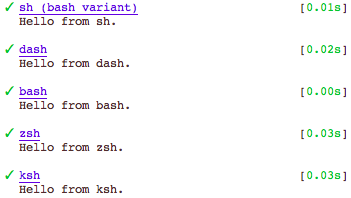

# shall

A CLI and REPL for invoking shell scripts or commands with multiple POSIX-like shells for portability testing on Unix-like systems.

**`shall`** (for *sh*ell with *all* (POSIX-like) shells) offers a convenient way of running a given shell script or shell command
with a default set or specifiable set of POSIX-like shells, so as to facilitate testing of portable (POSIX-compliant, cross-shell) shell code.

By default, the following shells are targeted, if installed: **sh, dash, bash, zsh, ksh**

Additionally, you can use `shall`:

* as a REPL, with `-i`.
* in a script's shebang line.

Each shell's execution is automatically timed to allow performance comparisons.

The syntax is modeled on that of the underlying shells.

See the [Usage](#usage) chapter for details.

## Quick Examples

```sh

# Echo the name of each executing shell; sample output included.
$ shall -c 'echo "Hello from $0."'
```



```sh

# Pass a script to all shells via stdin, plus an argument on the command line.
echo 'echo "Passed to $0: $1"' | shall -s one

# Execute script 'foo' with argument 'bar' in all shells.
shall foo bar

# Print the type of the 'which' command in bash and zsh.
shall -l bash,zsh -c 'type which'

# Enter a REPL that evaluates commands in both bash and dash.
SHELLS=bash,dash shall -i

```

## Installation

With [node.js](http://nodejs.org/) installed, install via the [npm registry](https://www.npmjs.com/) (you may have to prepend `sudo`):

	npm install shall -g

<!-- DO NOT EDIT: This chapter is updated by `make update-readme/release`. ALSO, LEAVE AT LEAST 1 BLANK LINE AFTER THIS COMMENT. -->

## Usage

```
$ shall -h

SYNOPSIS
  shall [-w shellA,...] [-q|-Q] [-p opts] script      [arg ...]
  shall [-w shellA,...] [-q|-Q] [-p opts] -c command  [arg0 arg ...]
  shall [-w shellA,...] [-q|-Q] [-p opts] [-s          arg ...]
  shall [-w shellA,...]  -i

DESCRIPTION
  Invokes a shell script or command with multiple POSIX-like shells in
  sequence for cross-shell compatibility testing.

  Pass a *script filename* as the first operand, optionally followed by 
  arguments to pass to the script.
  If shall is in your PATH, you can also create executable scripts
  based on it by using the following shebang line:
    #!/usr/bin/env shall
  
  Use -c to specify a *command string* instead; note that the first argument
  after the command string is assigned to $0(!).
  
  Use -s to read from *stdin*; -s is optional, if no arguments are passed.
  
  Use -i to enter *interactive mode*: a simple REPL, where one command
  at a time is read from the terminal and executed.

  By default, the following shells - if installed - are targeted:
    sh, dash, bash, zsh, ksh

  To specify shells explicitly, use either of the following (in order of
  precedence):
   - Option -w shellA,...; e.g., shall -w bash,zsh ...
   - Environment variable 'SHELLS'; e.g.: SHELLS=bash,zsh shall ...

  -q, -Q
    Quiet modes: 
     -q suppresses stdout output from the command/script invoked.
     -Q suppresses both stdout and stderr.
    Note that per-shell and overall success status information is still
    reported.

  -p 
    Allows you to pass options through to the shells invoked, as a single
    argument; e.g., -p '-e -o noglob'
    Make sure all shells targeted support the specified options; all
    POSIX-like should support the same options as the `set` builtin
    (see http://is.gd/MJPvPr).

NOTES
  The exit code reflects the number of shells that reported failure; i.e.,
  it is 0 if all shells ran the command successfully.

  Output is selectively colored, but only when outputting to a terminal.
  Note that only shall's *own* errors are sent to stderr, whereas
  captured command/script output (interleaved stdout and stderr) is always
  reported via stdout.
  When outputting to a terminal and a command/script's invocation fails for a
  given shell, the (entire) output captured is printed in red.
  
  Timing information is reported for each shell.
  
  In interactive mode (-i), history is maintained in file $HOME/.shall_history
  
  To get the name of the running shell from within your code in any of the
  invocation scenarios, use:
    $(ps -o comm= $$)
  When using a command string (-c) or stdin input (-s), you can also
  use $0

EXAMPLES
    # Echo the name of each executing shell.
  shall -c 'echo "Hello from $0."'
    # Also echo the 1st argument passed.                
  echo 'echo "Passed to $0: $1"' | shall -s one
    # Execute a script, passing the -e shell option (abort on errror).
  shall -p '-e' someScript
    # Print the type of the 'which' command in bash and zsh.
  shall -w bash,zsh -c 'type which'
    # Enter a REPL that evaluates commands in both bash and dash.
  SHELLS=bash,dash shall -i
  
```

<!-- DO NOT EDIT: This chapter is updated by `make update-readme/release`. ALSO, LEAVE AT LEAST 1 BLANK LINE AFTER THIS COMMENT. -->

## License

Copyright (c) 2014 Michael Klement, released under the [MIT license](https://spdx.org/licenses/MIT#licenseText).

### Acknowledgements

This project gratefully depends on the following open-source components, according to the terms of their respective licenses.

[npm](https://www.npmjs.com/) dependencies below have optional suffixes denoting the type of dependency; the absence of a suffix denotes a required run-time dependency: `(D)` denotes a development-time-only dependency, `(O)` an optional dependency, and `(P)` a peer dependency.

<!-- DO NOT EDIT: This chapter is updated by `make update-readme/release`. ALSO, LEAVE AT LEAST 1 BLANK LINE AFTER THIS COMMENT. -->

### npm Dependencies

* [json (D)](https://github.com/trentm/json)
* [replace (D)](https://github.com/harthur/replace)
* [semver (D)](https://github.com/isaacs/node-semver)
* [urchin (D)](https://github.com/tlevine/urchin)

<!-- DO NOT EDIT: This chapter is updated by `make update-readme/release`. ALSO, LEAVE AT LEAST 1 BLANK LINE AFTER THIS COMMENT. -->

## Changelog

Versioning complies with [semantic versioning (semver)](http://semver.org/).

<!-- NOTE: An entry template is automatically added each time `make version` is called. Fill in changes afterwards. -->

* **v0.2.1** (2015-05-27):
  * [fix] Options passed through with -p are no longer ignored on Linux.
  * [fix] Removed extraneous status output.

* **v0.2.0** (2015-05-24):
  * [new] New -p option allows passing additional options through to the shells invoked; e.g.: -p '-e'
  * [deprecated] -l option for specifying shells to target renamed to -w to avoid confusion with shells' native -l version (login shells); -l will continue to work. 
  * [robustness] Exit codes relating to shall's *own* failures changed to: 126 (incorrect arguments) and 127 (unexpected failure), chosen so as to avoid clashes with exit codes produced during normal operation and termination by signal.

* **v0.1.7** (2015-02-11):
  * [doc] improved description in package.json

* **v0.1.6** (2015-02-11):
  * [fix] When using the default target shells, only those actually installed should be targeted.

* **v0.1.5** (2015-02-11):
  * [install] warning added, if bash not found
  * [dev] bash-presence test improved
  * [dev] Makefile improvements

* **v0.1.4** (2015-02-11):
  * [dev] testing no longer requires the CLI to be in the path
  * [dev] bash-presence test added
  * [dev] Makefile improvements
  * [doc] read-me improvements (examples)

* **v0.1.3** (2015-01-28):
  * [doc] read-me typo corrected
  * [dev] Makefile improvements

* **v0.1.2** (2015-01-27):
  * [fix] -q option no longer masks failures
  * [doc] CLI help and read-me updates
  * [dev] Urchin-based tests added

* **v0.1.1** (2014-12-23):
  * [doc] read-me and CLI help fixes

* **v0.1.0** (2014-12-23):
  * Initial release
